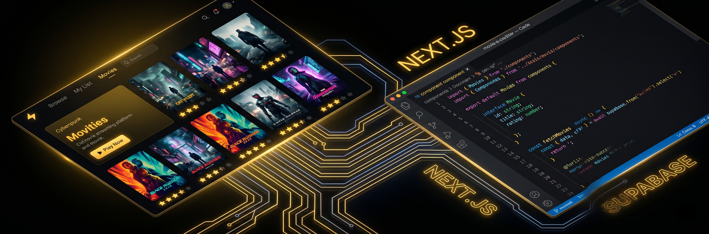

<div align="center">
  <br/>
  <h1>🎬 CineStack</h1>
  <p><strong>Your personal cinema companion — discover, review, and track your favorite movies.</strong></p>
  <br/>

  <p>
    
    
    
    
    
    <a href="https://github.com/mifdlaldev/cinestack/actions"></a>
  </p>

  <br/>
  <a href="https://github.com/mifdlaldev/cinestack">
    
  </a>
  <br/>
  <br/>

  <picture>
    <source media="(prefers-color-scheme: dark)" srcset="./public/hero-banner.png">
    
  </picture>
</div>

---

## 📋 Table of Contents

- [Overview](#-overview)
- [Key Features](#-key-features)
- [Tech Stack](#-tech-stack)
- [Architecture](#-architecture)
- [Getting Started](#-getting-started)
- [Project Structure](#-project-structure)
- [API Endpoints](#-api-endpoints)
- [Database Schema](#-database-schema)
- [Design System](#-design-system)
- [Contributing](#-contributing)
- [Roadmap](#-roadmap)

---

## 🎯 Overview

**CineStack** is a full-stack movie platform built as a portfolio project to demonstrate modern web development engineering. It integrates with **The Movie Database (TMDB)** API to provide a rich catalog of films, complete with user reviews, ratings, watchlists, and an admin panel.

### Why CineStack?

This project showcases **production-grade** full-stack development skills:

- **Clean Architecture** — Separation of concerns between server components, client components, API routes, and database layer.
- **Type Safety** — Full TypeScript strict mode with zero `any` types.
- **Real-World Features** — Authentication, rate limiting, admin panel, CRUD operations, relational data modeling, and external API integration.
- **Performance** — ISR caching, optimized images, efficient database queries, and lazy loading.
- **UI/UX** — Cinematic dark theme, responsive design, micro-interactions, and accessibility.

### Who Is This For?

- **Recruiters & Clients** — See production-quality code with real-world architecture decisions.
- **Developers** — Study a complete full-stack implementation with modern tooling.
- **Contributors** — Add features, fix bugs, or propose improvements.

---

## ✨ Key Features

<picture>
  <source media="(prefers-color-scheme: dark)" srcset="./public/mockup-collage.png">
  
</picture>

### 🎥 Movie Discovery
- **Browse** — Trending, popular, top-rated, now-playing, and upcoming movies.
- **Search** — Full-text search with TMDB integration.
- **Filter** — By genre, release year, rating, and streaming providers.
- **Details** — Cast, trailers, streaming providers, budgets, and revenue.
- **Similar Movies** — AI-powered recommendations via TMDB.

### ⭐ Reviews & Ratings
- **Write Reviews** — Rate movies on a 5-star scale with detailed text reviews.
- **Inline Editing** — Edit or delete your reviews without page reload.
- **Reply Threads** — Nested comment system (YouTube-style) with collapse at depth.
- **Optimistic Updates** — Instant UI feedback with background sync.
- **Role-Based Access** — Users manage their own content; admins moderate all.

### 👤 User System
- **Authentication** — Email/password with Supabase Auth, Google OAuth.
- **Rate Limiting** — Upstash Redis rate limiting to prevent abuse.
- **CAPTCHA** — Cloudflare Turnstile integration for spam protection.
- **Profile** — Manage personal information and view activity.
- **Watchlist** — Save movies to personal watchlist.

### 🛠️ Admin Panel
- **Dashboard** — Real-time stats (users, reviews, movies, reports).
- **Content Moderation** — Manage reviews, replies, and user reports.
- **News Management** — Create, edit, and publish movie/news articles.
- **Movie Sync** — Manually sync TMDB data for specific movies.
- **User Management** — View and manage registered users.

### 📰 News Portal
- **Auto-Feed** — Automated news articles from TMDB movie updates.
- **Manual Articles** — Admin-written news with rich text editor.
- **Categories** — Organized news sections for easy browsing.

### 🎨 Design
- **Cinematic Dark Theme** — Pure black backgrounds with warm gold accents.
- **Responsive** — 5 breakpoints from 375px to 1920px.
- **Animations** — Framer Motion with smooth scroll-reveal and micro-interactions.
- **Accessibility** — WCAG contrast ratios, keyboard navigation, screen reader support.
- **Performance** — Lighthouse scores ≥ 95 across all categories.

---

## 🛠️ Tech Stack

### Core
| Technology | Purpose |
|------------|---------|
| **Next.js 15** (App Router) | Full-stack React framework with SSR, ISR, and Server Actions |
| **TypeScript** (strict) | Type-safe development with zero `any` types |
| **Node.js 22** | JavaScript runtime |

### Frontend
| Technology | Purpose |
|------------|---------|
| **Tailwind CSS v4** | Utility-first styling with custom design system |
| **Framer Motion** | Animations, scroll-reveal, and micro-interactions |
| **React Hook Form + Zod** | Form validation and state management |
| **TanStack React Query** | Server state management and caching |
| **Zustand** | Client state (watchlist, UI preferences) |

### Backend & Database
| Technology | Purpose |
|------------|---------|
| **Supabase** | PostgreSQL database, authentication, and storage |
| **Next.js Route Handlers** | REST API endpoints |
| **Server Actions** | Server-side mutations with revalidation |
| **Upstash Redis** | Rate limiting and caching |

### External APIs
| API | Purpose |
|-----|---------|
| **TMDB API** | Movie catalog, cast, trailers, streaming providers |
| **Google OAuth** | Social login via Supabase Auth |
| **Cloudflare Turnstile** | CAPTCHA for form spam protection |

### DevOps & Tooling
| Tool | Purpose |
|------|---------|
| **Vercel** | Hosting with ISR and CDN |
| **GitHub Actions** | CI/CD pipeline |
| **ESLint + Prettier** | Code quality and formatting |
| **Vitest** | Unit and integration tests |
| **Playwright** | E2E testing |

---

## 🏗️ Architecture

```
┌─────────────────────────────────────────────────────────┐
│                     Client Layer                         │
│  ┌─────────────┐  ┌──────────┐  ┌────────────────────┐  │
│  │ Next.js App  │  │ React    │  │ Zustand            │  │
│  │ Router (SSR) │  │ Query    │  │ (Watchlist, UI)    │  │
│  └─────────────┘  └──────────┘  └────────────────────┘  │
├─────────────────────────────────────────────────────────┤
│                     API Layer                            │
│  ┌────────────────┐  ┌────────────────────────────────┐  │
│  │ Route Handlers │  │ Server Actions                 │  │
│  │ (REST API)     │  │ (submitReview, deleteReview)   │  │
│  └────────────────┘  └────────────────────────────────┘  │
├─────────────────────────────────────────────────────────┤
│                   Service Layer                          │
│  ┌──────────┐  ┌───────────┐  ┌───────────────────────┐ │
│  │ TMDB     │  │ Rate      │  │ Auth (Supabase)       │ │
│  │ Service  │  │ Limiter   │  │ Session Management    │ │
│  └──────────┘  └───────────┘  └───────────────────────┘ │
├─────────────────────────────────────────────────────────┤
│                   Data Layer                             │
│  ┌────────────┐  ┌────────────────────────────────────┐  │
│  │ Supabase   │  │ Upstash Redis                      │  │
│  │ PostgreSQL │  │ (Rate limiting + Cache)            │  │
│  └────────────┘  └────────────────────────────────────┘  │
└─────────────────────────────────────────────────────────┘
```

### Key Architectural Decisions

| Decision | Rationale |
|----------|-----------|
| **Server Components first** | Reduce client-side JavaScript, improve SEO and initial load |
| **React Query for client state** | Optimistic updates, background refetching, cache invalidation |
| **Supabase RLS** | Database-level security — not reliant on client-side checks |
| **ISR for TMDB data** | Cache movie pages with 1-hour revalidation |
| **Separate API routes from Server Actions** | Route handlers for GET/read operations, Server Actions for POST/write operations |

---

## 🚀 Getting Started

### Prerequisites

- Node.js 22+
- npm or pnpm
- Supabase project (free tier)
- TMDB API key (free)
- Upstash Redis (free tier) — for rate limiting
- Cloudflare Turnstile (free) — for CAPTCHA

### 1️⃣ Clone the Repository

```bash
git clone https://github.com/mifdlaldev/cinestack.git
cd cinestack
npm install
```

### 2️⃣ Set Up Environment Variables

Copy `.env.example` to `.env.local` and fill in your credentials:

```bash
cp .env.example .env.local
```

| Variable | Description | Where to Get |
|----------|-------------|--------------|
| `NEXT_PUBLIC_SUPABASE_URL` | Supabase project URL | Supabase Dashboard → Settings → API |
| `NEXT_PUBLIC_SUPABASE_ANON_KEY` | Supabase anon/public key | Supabase Dashboard → Settings → API |
| `TMDB_API_KEY` | TMDB API v3 key | [TMDB Settings → API](https://www.themoviedb.org/settings/api) |
| `TMDB_READ_ACCESS_TOKEN` | TMDB API read token | [TMDB Settings → API](https://www.themoviedb.org/settings/api) |
| `UPSTASH_REDIS_REST_URL` | Upstash Redis REST URL (optional) | [Upstash Console](https://console.upstash.com) |
| `UPSTASH_REDIS_REST_TOKEN` | Upstash Redis token (optional) | [Upstash Console](https://console.upstash.com) |
| `NEXT_PUBLIC_TURNSTILE_SITE_KEY` | Cloudflare Turnstile site key (optional) | [Cloudflare Dashboard → Turnstile](https://dash.cloudflare.com) |
| `TURNSTILE_SECRET_KEY` | Cloudflare Turnstile secret key (optional) | [Cloudflare Dashboard → Turnstile](https://dash.cloudflare.com) |

> **Note:** TMDB and Supabase are **required** for the app to function. Upstash and Turnstile are optional — the app falls back gracefully.

### 3️⃣ Set Up Database

Run the SQL schema against your Supabase project:

```bash
# Option A: Paste into Supabase SQL Editor (recommended)
# Open supabase/schema.sql and copy into https://supabase.com/dashboard/project/your-project/sql/new

# Option B: Using Supabase CLI
supabase db push
```

### 4️⃣ Start Development Server

```bash
npm run dev
```

Open [http://localhost:3000](http://localhost:3000) — the app should be running.

### Available Scripts

| Command | Description |
|---------|-------------|
| `npm run dev` | Start development server |
| `npm run build` | Production build |
| `npm run start` | Start production server |
| `npm run lint` | Run ESLint |

---

## 📁 Project Structure

```
cinestack/
├── src/
│   ├── app/                    # Next.js App Router
│   │   ├── (main)/             # Main layout group
│   │   ├── about/              # About page
│   │   ├── actors/             # Actor profiles and search
│   │   ├── admin/              # Admin dashboard panel
│   │   ├── api/                # REST API route handlers
│   │   │   ├── admin/          # Admin API endpoints
│   │   │   ├── auth/           # Auth API (rate limiting)
│   │   │   ├── movies/         # Movie data endpoints
│   │   │   ├── news/           # News CRUD endpoints
│   │   │   ├── reviews/        # Review CRUD endpoints
│   │   │   └── watchlist/      # Watchlist CRUD endpoints
│   │   ├── auth/               # Auth pages (login/register)
│   │   ├── contact/            # Contact page
│   │   ├── discover/           # Movie discovery & filtering
│   │   ├── genre/              # Genre-based browsing
│   │   ├── movies/             # Movie detail pages
│   │   ├── news/               # News portal
│   │   ├── profile/            # User profile
│   │   └── search/             # Search results
│   ├── components/
│   │   ├── layout/             # Layout components (Navbar, Footer, Hero)
│   │   └── ui/                 # Reusable UI components
│   ├── lib/                    # Utilities and services
│   ├── types/                  # TypeScript type definitions
│   └── actions/                # Server Actions
├── supabase/                   # Database migrations
│   ├── schema.sql              # Full database schema
│   ├── fix-users.sql           # User backfill script
│   └── fix-users-rls.sql       # RLS policy fixes
├── public/                     # Static assets
└── docs/                       # Documentation
    └── PLAN.md                 # Project plan and architecture
```

### Key Files

| File | Purpose |
|------|---------|
| `src/app/layout.tsx` | Root layout with providers (React Query, Auth) |
| `src/components/ui/ReviewSection.tsx` | Review system with optimistic updates |
| `src/lib/tmdb.ts` | TMDB API client configuration |
| `src/lib/supabase.ts` | Supabase server client |
| `src/lib/rate-limiter.ts` | Upstash Redis rate limiter |
| `supabase/schema.sql` | Complete database schema (idempotent) |

---

## 📡 API Endpoints

### Reviews
| Method | Endpoint | Description |
|--------|----------|-------------|
| `GET` | `/api/reviews?movieId=&page=` | List reviews for a movie |
| `PUT` | `/api/reviews/[id]` | Edit review (inline) |
| `POST` | `/api/reviews/[id]/reply` | Reply to review |

### Movies
| Method | Endpoint | Description |
|--------|----------|-------------|
| `GET` | `/api/movies/search?q=` | Search movies |
| `GET` | `/api/movies/discover?` | Discover with filters |
| `GET` | `/api/movies/similar?id=` | Similar movies |
| `GET` | `/api/movies/genres` | Movie genres |
| `GET` | `/api/movies/providers` | Streaming providers |

### Watchlist
| Method | Endpoint | Description |
|--------|----------|-------------|
| `GET` | `/api/watchlist` | Get user's watchlist |
| `POST` | `/api/watchlist` | Add to watchlist |
| `DELETE` | `/api/watchlist/[id]` | Remove from watchlist |

### Admin
| Method | Endpoint | Description |
|--------|----------|-------------|
| `GET` | `/api/admin/stats` | Dashboard statistics |
| `GET` | `/api/admin/reviews` | Manage all reviews |
| `GET` | `/api/admin/users` | Manage users |
| `CRUD` | `/api/admin/news` | News articles |
| `CRUD` | `/api/admin/replies` | Reply moderation |

---

## 🗄️ Database Schema

### Tables
| Table | Purpose |
|-------|---------|
| `users` | User profiles with role (user/admin) |
| `reviews` | Movie reviews and ratings (1-10 scale) |
| `watchlists` | User movie watchlists |
| `news_articles` | News and articles |
| `review_reports` | User-generated reports on reviews |

### Security
- **RLS (Row Level Security)** enabled on all tables
- Users can read any profile; edit only their own
- Reviews are publicly readable; only owners can edit/delete
- Admin actions restricted to users with `admin` role

> Full schema in [`supabase/schema.sql`](./supabase/schema.sql).

---

## 🎨 Design System

| Token | Value | Usage |
|-------|-------|-------|
| `--color-bg` | `#000000` | Page background |
| `--color-surface` | `#0a0a0a` | Card background |
| `--color-text` | `#f5f5f1` | Primary text (warm white) |
| `--color-accent` | `#f5c518` | Accent (warm gold) |

### Typography
| Role | Font | Weight |
|------|------|--------|
| Display | **Archivo Black** | 900 |
| Body | **Inter** | 400 |
| Mono | **JetBrains Mono** | 400 |

---

## 🤝 Contributing

I welcome contributions! CineStack is designed to be a collaborative project where developers can learn, experiment, and contribute.

### How to Contribute

1. **Fork the repository**
2. **Create a feature branch**:
   ```bash
   git checkout -b feat/your-feature-name
   ```
3. **Make your changes** following the existing patterns:
   - TypeScript strict mode — no `any` types
   - Server Components first, Client Components only when needed
   - Optimistic updates for mutations
   - Accessible and responsive UI
4. **Commit with Conventional Commits**:
   ```bash
   git commit -m "feat: add your feature"
   ```
5. **Push and open a Pull Request**:
   ```bash
   git push origin feat/your-feature-name
   # Then open a PR on GitHub
   ```

### Development Guidelines

- **Code Style**: ESLint + Prettier, 2-space indentation, single quotes
- **Components**: Keep focused; extract reusable logic to `lib/`
- **State**: Server Components for static data, React Query for dynamic data, Zustand for UI
- **Database**: Parameterized queries via Supabase SDK
- **Security**: No hardcoded secrets; environment variables for all sensitive data

### Ideas for Contributions

- [ ] **Dark/Light theme toggle** — Implement theme switching
- [ ] **PWA support** — Offline access and installable app
- [ ] **i18n** — Multi-language support
- [ ] **Movie recommendations** — ML-based suggestions
- [ ] **Social features** — Follow users, activity feed
- [ ] **Mobile app** — React Native version
- [ ] **Test coverage** — Unit, integration, and E2E tests
- [ ] **Performance** — Bundle optimization, image optimization

---

## 🗺️ Roadmap

**Phase 1 — Foundation** ✅
Next.js 15, TypeScript, Supabase, TMDB integration, movie catalog, auth

**Phase 2 — Interaction** ✅
Reviews, ratings, reply threads, optimistic updates, rate limiting, CAPTCHA

**Phase 3 — Administration** ✅
Admin dashboard, content moderation, news management, user management

**Phase 4 — Polish** 🔄
Lighthouse ≥ 95, tests, documentation, performance optimization

**Phase 5 — Future** 🚀
Theme toggle, recommendations, social features, PWA, mobile app, i18n

---

<div align="center">
  <br/>
  <p>Built with ❤️ by <a href="https://github.com/mifdlaldev">Mifdlal Tsaqib Alfarras</a></p>
  <p>
    <a href="https://github.com/mifdlaldev/cinestack/issues">Report Bug</a>
    ·
    <a href="https://github.com/mifdlaldev/cinestack/issues">Request Feature</a>
    ·
    <a href="https://github.com/mifdlaldev/cinestack/discussions">Ask Question</a>
  </p>
  <br/>
</div>
